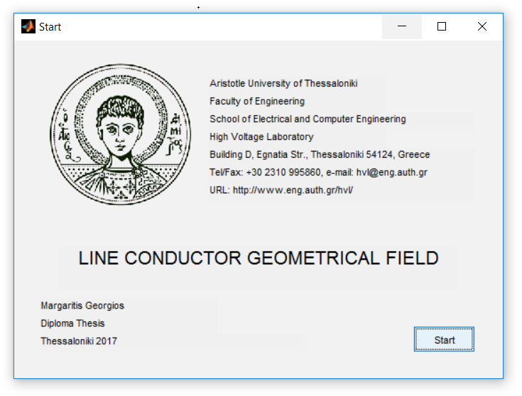
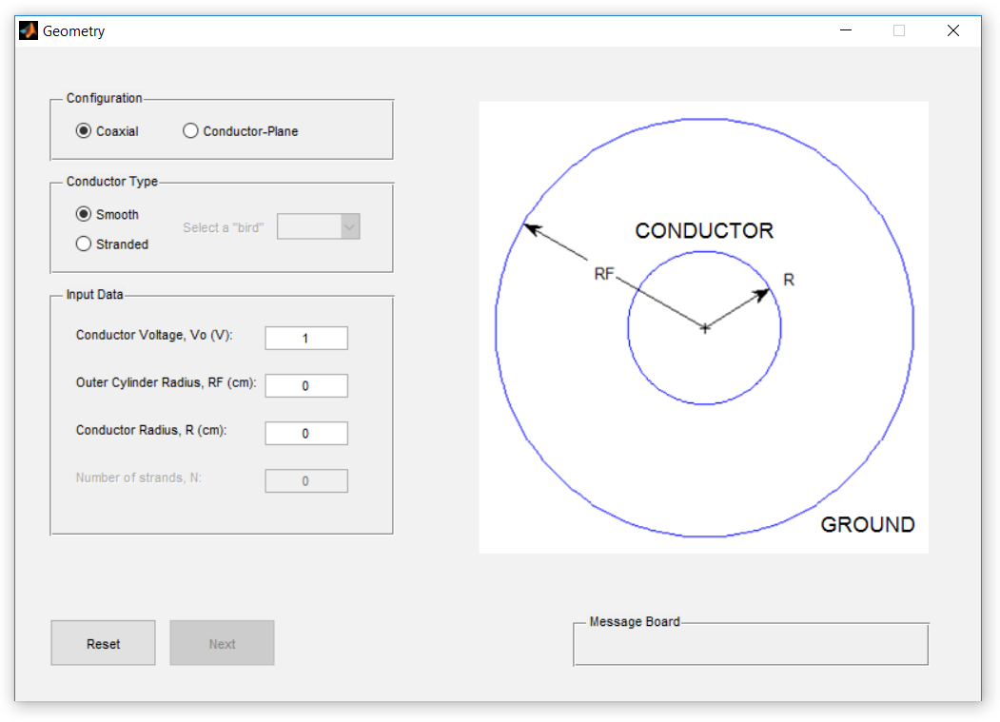
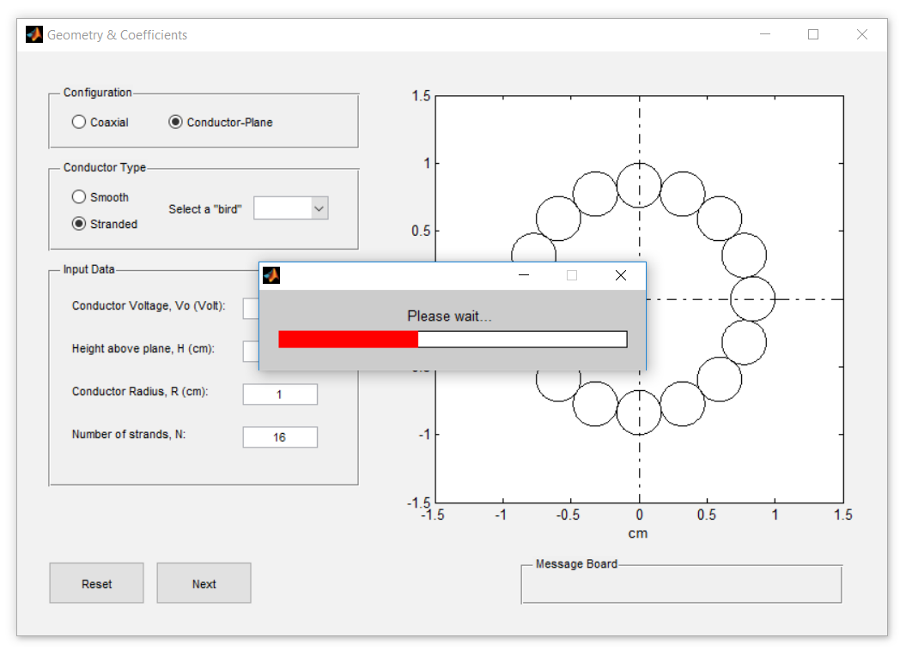
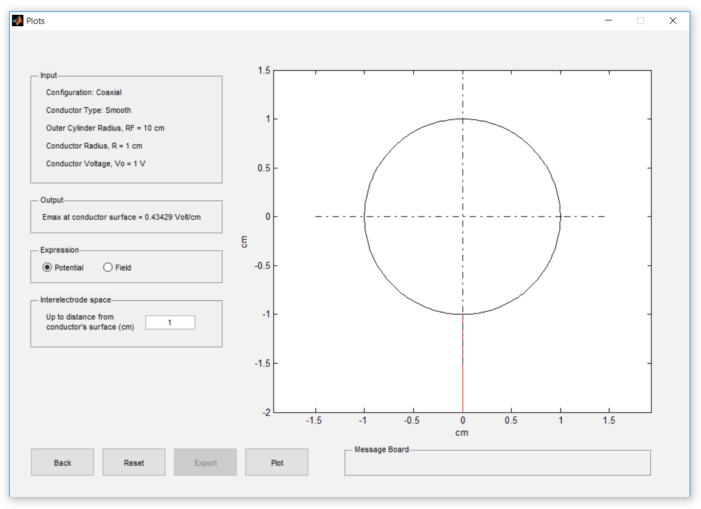
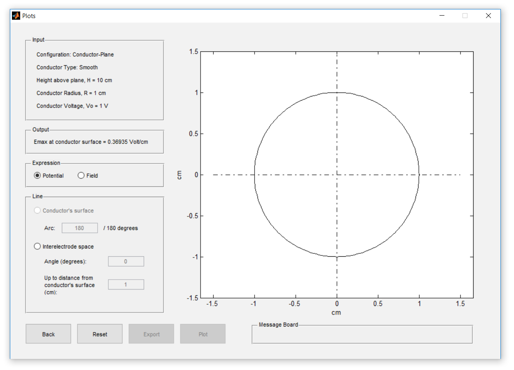
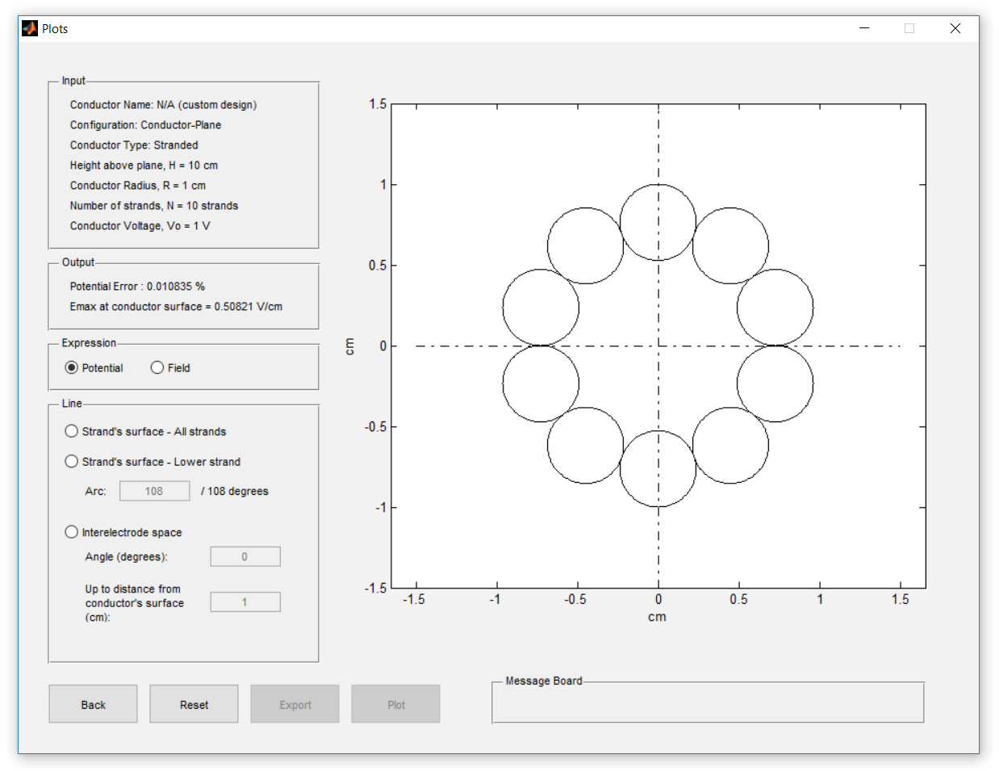
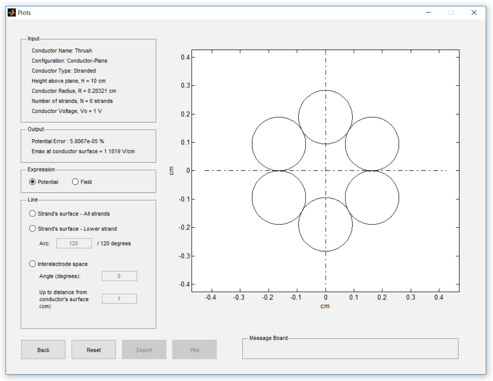

# Line Conductor Geometrical Field

## Introduction

The purpose of this simulation app is to calculate the values of the geometrical field around overhead  lines by using a semi-analytical method. By the term *geometrical field* we mean the electrostatic field around a conductor without taking into account the influence of free charges in the interelectrode space. The method used is presented in detail [here](https://ikee.lib.auth.gr/record/294148/?ln=en) and was implemented in the form of Matlab algorithms contained in this repository. To minimize the time needed for the calculation of the field and potential values, these algorithms were "packaged" in a graphical user interface. This way, the user needs not to know anything about the algorithm being used, just provide the software with the input parameters and obtain the field values as output.

## Release

The app is available in Windows only (sorry about that). You can download the latest release [here](https://github.com/gemargar/LCGF/releases). You can download MATLAB Compiler Runtime (MCRInstaller.exe) [here](https://www.mathworks.com/products/compiler/matlab-runtime.html). Since the app was built in MATLAB R2013a (8.1), make sure you install the correct MCR version before running the application, which is **R2013a (8.1)**.

## Start Window

Upon double-clicking the app icon, the above window shows up. By pressing the 'Start' button, the user is prompted to the next window of the application.

## Geometry Window

In this window the user is prompted to set up the configuration. The choices made are reflected to the image on the right, which changes according to the input provided. In case the stranded conductor is selected and the input data is sufficient (conductor radius and number of strands), a cross-section of the conductor is shown.

### Groups Boxes

In the left hand side there are four groups boxes, which implement the following functionalities.

- **Configuration** contains radio buttons that set the form of the gap. The available options are *coaxial* (where the conductor is placed inside a concentric cylinder of zero potential) and the *conductor-plane* (where the conductor is placed above an infinite plane of zero potential). The default selecion is coaxial gap.

- **Conductor type** contains radio buttons that set the type of conductor. The available options are *smooth cylinder* and *stranded conductor*. The default value is smooth cylinder. The solution of the first type is known from electrostatic field theory, so no algorithm is required. In the case of the second type, a drop-down menu is activated listing 4 typical <abbr title="Aluminium Conductor Steel-Reinforced cables">ACSR</abbr> cables. The conductors have bird names: [thrush](https://en.wikipedia.org/wiki/Thrush_(bird)), [linnet](https://en.wikipedia.org/wiki/Common_linnet), [catbird](https://en.wikipedia.org/wiki/Catbird) and [falcon](https://en.wikipedia.org/wiki/Falcon), hence the name of the pop-up menu: *Select a "bird"*.

- **Input Data** contains 4 line-edit boxes. The *Conductor Voltage* and *Conductor Radius* boxes are common in every configuration. For the second line-edit, if the coaxial gap configuration is selected, the user is prompted to provide the *Outer Cylinder Radius* value. If the conductor-plane configuration is selected, then the *Conductor Height* from the plane is requested. Finally, if stranded conductor is selected, the last line-edit is enabled and the *Number of strands* is requested.

- **Message Board** prompts the user with error messages. For all of the above inputs there is an acceptable value range. Any violation of these limits will result in a message being displayed in this field.

#### Variable ranges
For the coaxial gap the rule is:

$$RF>R>0$$

where $R$ the conductor radius and $RF$ the outer cylinder radius. Similarly, for the conductor-plane gap the rule is:

$$H>R>0$$

where $R$ the conductor radius and $H$ is the height of the conductor relative to the plane. Furthermore, if the conductor is stranded it must be:

$$N \geq 3 , \hspace{2mm} N \in \mathbb{N}$$

That is, the number of strands N must be a positive integer greater than or equal to 3. Finally, the following rule must apply:

$$V_o>0$$

That is, the operating voltage must be non-zero. In case of an unacceptable input, a corresponding message is displayed. At the same time, the incorrect input is highlighted to hint the user.

### Push Buttons

At the bottom of the window there are two push buttons, which implement the following functions.

- The **Reset** button is always enabled and allows the user to reset the default settings.
- The **Next** button becomes enabled once the data provided is sufficient. When pressed, the calculation of the coefficients of the algorithm begins. This process may take a while, therefore a waiting bar appears with the message *Please wait...*. When the process is over, the next window will show up.

## Plots window

This window varies depending on the options that have been selected in the previous step. To avoid repetition, the general structure of the window will be presented, followed by a specific description of the features on a case-by-case basis. In general, the window consists of an axis system, 5 group boxes and 4 push buttons. Just like the previous window, the axis system depicts the current configuration.

### Group Boxes

- **Input** summarizes the choices made in the previous step. In the case of a preselected stranded conductor, its name is also indicated. If custom, the indication *N/A (custom design)* is displayed.

- **Output** contains the maximum field value on the surface of the conductor. In the case of stranded conductors, the potential error is also indicated.

- **Expression** contains radio buttons for selecting the quantity to be calculated. The available options are *Potential* and *Field*.

- **Line** sets the curve on which the above expression is to be calculated. Generally there are two options: 
    - the conductor surface (Conductor's surface for a smooth cylindrical conductor and Strand's surface for a stranded conductor)
    - the interelectrode space, meaning a line segment starting at the conductor surface and having a variable length and direction.

- **Message board** implements the same functionality as in the previous window.

### Push Buttons

- **Back** advances the user to the previous window.
- **Reset** deletes all options and resets the default values.
- **Export** is enabled only after an expression is evaluated and offers the option to export the values of the quantity in a csv file.
- **Plot** displays a graph showing the values of the selected quantity on the selected curve.

### Special features

#### Smooth cylinder in coaxial gap

In the case of a smooth cylindrical conductor in a coaxial gap, the only available option for the potential and field is in the interelectrode space. The quantities on the surface of the conductor are known; the potential is equal to the operating voltage, the field is equal to that of the maximum field. Furthermore, for the line segment in the interelectrode space, the angle is not available; since the field is perfectly symmetrical, it does not change with the angle.

#### Smooth cylinder over infinite plane

In the case of a smooth cylinder over an infinite plane, the potential on the surface of the conductor is known and equal to the operating voltage. Therefore, the choice of the conductor surface is only available for the field. For this setting, the option is given to select the arc on which the user wishes the field to be calculated. The arc is given in degrees from 0 to 180; since the configuration is symmetric, angles greater than 180 degrees are of no interest. When the line-edit is changed, an arc of the selected angle is highlighted in the cross-section. For the change to take effect, one should click anywhere on the window. Finally, for the interelectrode space, the field is not symmetric, so the angle of the line segment is requested.

#### Stranded conductor in a coaxial gap

In the case of a stranded conductor, all options are available. In the *Line* group box, there are three line-edit boxes that require numerical input from the user. In *Strand's surface - Lower Strand*, the arc (in degrees) is requested. The angle is "measured" from the bottom of the strand; the maximum value is listed next to the input. The selection is highlighted with red on the cross-section.

The second option is *Interelectrode Space*. This option allows the user to export the field or potential values on a line segment starting from the conductor surface and having a variable length and direction. The direction is expressed in terms of the angle $\alpha$, which starts at the axis of symmetry of the strand. The acceptable value range for this angle is:

$$0 \leq \alpha \leq {\alpha}_{critical}$$

where ${\alpha}_{critical}$ is the angle for which the line segment is tangent to the adjacent strand. For a given angle $\alpha$, the acceptable range of values for the length of the line segment $d$ is:

$$0 \leq d \leq {d}_{critical}$$

where ${d}_{critical}$ is the distance from the surface of strand to the outer cylinder for the angle selected.

#### Stranded Conductor over an infinite plane

Finally, for a stranded conductor over a plane there is the *Strand's Surface - All strands* option, which covers the entire outer surface of the conductor. Since the arrangment is symmetric, only one half is examined. The remaining options in the *Line* group box have the same application as in the case of the coaxial gap. The only difference for a conductor over a plane arrangment, where distance ${d}_{critical}$ is defined as the distance from the strand surface to the ground plane. There is also the additional restriction that $\alpha < 90^{\circ}$, otherwise the distance reaches infinity.